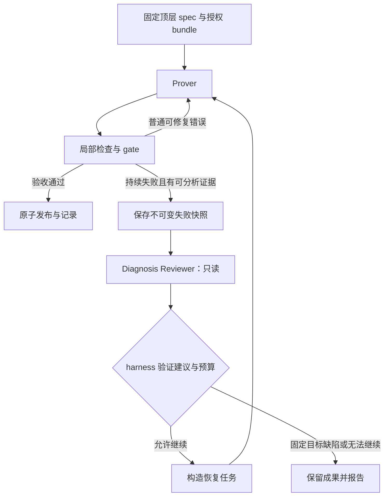

# Lean agent 的 subagent 分工建议

分析日期：2026-10-05。

本文讨论本项目应该引入哪些独立 agent、为什么拆分，以及如何与现有 harness 结合。当前已接入可选的只读 Diagnosis Reviewer，使用方式与实现边界见第 8 节；其余尚未标注实现的流程仍是设计建议。

## 结论

当前先采用两种角色：**Prover（证明与内部 spec 设计）**和 **Diagnosis Reviewer（失败诊断）**。Prover 是主要工作会话；Reviewer 在持续失败时启动，使用独立上下文，只读分析证据。

当实验扩展到自动恢复缺失的顶层 spec 时，再加入 **Spec Writer** 和 **Spec Reviewer**。顶层声明经过审查与规定的检查后冻结，再交给新的 Prover。

调度、权限控制、编译、快照和最终验收由确定性的 harness 程序完成。LLM agent 提供候选成果与诊断建议，不能决定自己的验收规则。

## 1. 当前任务决定分工

项目需要区分两类实验：

1. **固定顶层 spec 的证明实验**：给定顶层声明，agent 设计所需内部 spec，并完成内部与顶层证明。
2. **缺失顶层 spec 的恢复实验**：只给出部分顶层 spec，agent 还需要恢复其他顶层声明，再证明它们。

目前 `harness/prove_top_spec.py` 的 joint 模式主要对应第一类任务：一个会话联合处理缺失的内部 spec 文件和固定顶层证明，通过 gate 后原子发布。独立诊断与恢复的方案已写在 [PLAN-REVISE-LOOP.md](PLAN-REVISE-LOOP.md)，不能把该方案中的全部流程当作已实现功能。

内部 spec 的设计与调用者证明联系紧密。一个内部 spec 即使真实且已证明，也可能缺少调用者需要的范围、等式或表示关系。因此，应允许同一个 Prover 在内部接口和顶层证明之间反复调整。

## 2. 推荐角色

| 角色 | 启动条件 | 主要工作 | 修改权限 | 引入阶段 |
| --- | --- | --- | --- | --- |
| Prover | 新证明任务或授权后的恢复任务 | 规划证明、设计内部 spec、添加 helper、完成 Lean 证明 | 明确列出的 spec／证明文件；固定顶层声明不可改 | 当前核心 |
| Diagnosis Reviewer | 持续失败、重复超时、预算耗尽 | 判断失败类别，指出缺陷位置和证据，提出修复建议 | 只读失败快照、允许的源码与诊断 | 已接入，默认关闭 |
| Spec Writer | 实验要求恢复缺失的顶层 spec | 根据允许的需求、代码与库定义生成候选声明 | 指定的待生成顶层 spec | 后续 |
| Spec Reviewer | 候选顶层 spec 生成或修订后 | 检查覆盖、语义、量词、假设、结论与空洞性 | 只读；通过报告提出修改要求 | 与 Spec Writer 一起引入 |

角色数量与进程数量不同：多个独立目标可以使用多个 Prover 实例；Reviewer 按需启动。每个角色无需常驻一个进程。

### Prover：同时负责内部 spec 和证明

输入包括固定目标、相关实现、允许使用的依赖、编辑范围、预算，以及可恢复状态。

Prover 负责：

- 检索已有定理，提出简短证明路线。
- 根据调用者的实际需要设计内部 spec。
- 自主增加局部 helper，并验证它们能组合成最终目标。
- 使用局部检查工具获取真实诊断，记录失败路线和下一步。
- 提交候选修改；预算耗尽时保留准确的未完成状态。

初期无需再拆出独立 Planner、内部 Spec Writer 或 helper agent。这样可以减少接口尚未稳定时的交接成本，也避免不同 agent 分别优化出无法组合的局部结果。

### Diagnosis Reviewer：独立检查失败原因

独立会话的价值在于重新审视失败证据，减少 Prover 在同一条无效路线上的重复尝试。Reviewer 不必在每次普通 Lean 报错后运行；局部错误优先由 Prover 自己修复。

当前采用第 8 节的连续 3 次失败、连续 2 次超时和预算耗尽规则。触发阈值作为实验参数记录，不凭文件修改次数判断数学进展。

Reviewer 应区分：

| 诊断 | 需要的证据 | 后续动作 |
| --- | --- | --- |
| 证明路线或 tactic 困难 | 具体 goal、失败方法和诊断 | 建议另一条路线，保持声明与权限不变 |
| 内部 spec 不足 | 调用者需要的性质、已有 spec 实际提供的性质及缺口 | 优先建议添加加强版 spec；由 harness 验证修订范围 |
| 新生成的内部声明有问题 | 反例、矛盾、缺失假设或定义展开后的具体问题 | Prover 在原授权范围内修正并重新证明 |
| 固定顶层声明疑似有问题 | 具体反例或形式化不一致证据 | 停止该任务并报告；不得自动放宽固定目标 |
| 工具或构建故障 | 进程、日志、退出码或环境错误 | 交给基础设施恢复流程；明确故障无需先调用 LLM |
| 无法确定 | 证据不足或多个解释仍可能成立 | 明确不确定性，不强行归因 |

“暂时找不到证明”不能被当成“命题是假的”；“加强内部 spec 可能有帮助”也不能被当成必须修改已接受声明的证明。

Reviewer 输出应包含诊断类别、相关声明与位置、证据、建议动作和不确定性。它不能修改 gate、扩大 allowlist，或直接授予修改已接受 spec 的权限。

### Spec Writer 与 Spec Reviewer：用于顶层 spec 恢复

这两个角色在第二类实验中才有必要。

Writer 从允许的输入中提出候选声明；Reviewer 独立对照需求和实现，检查：

- 是否覆盖要求的行为，有无遗漏关键保证。
- 量词、类型、定义域、前提和结论是否表达准确。
- 是否通过无法满足的前提让结论空洞成立。
- 是否仅表达了容易证明、但不足以满足需求的性质。
- 定义、类型转换和库 API 是否代表预期对象。

修订与审查次数应有限，并计入总预算。审查后冻结顶层声明，再启动新 Prover，避免在证明困难时悄悄改变目标。

LLM 的审查通过不能证明“保证不弱于参考 spec”。若实验要求这一性质，需要另外定义机器检查的比较义务或其他明确的独立评估标准。隐藏的参考 spec 只能交给授权的最终评估流程，不能泄露给 Writer、Reviewer 或 Prover。

## 3. 建议执行流程

当前固定顶层 spec 的流程：



未来的顶层 spec 恢复流程是在入口增加：

```text
允许的需求与代码
    → Spec Writer
    → Spec Reviewer
    → 有限次修订与规定检查
    → 冻结顶层声明
    → 新 Prover 会话
```

恢复时，纯证明路线调整可以继续原 Prover 会话；涉及编辑权限或已接受 spec 的修订时，建议构造新的 Prover 会话，明确传入新的权限和失败证据。

## 4. 进程、上下文与交接

本项目初期可以用 Python 调度器启动独立 agent 子进程，无需先引入 Slurm。每次独立会话应有可识别的任务 ID、输入清单、日志和结果记录；可写 Prover 使用隔离工作目录，Reviewer 读取不可变快照。

不同 agent 通过明确的任务与成果交接，不依赖共享对话历史：

| 交接材料 | 必要内容 |
| --- | --- |
| 任务输入 | 固定目标、源码与配置版本、允许读取的依赖、编辑范围、预算 |
| 证明状态 | 当前义务、helper 清单、已尝试路线、最近的检查结果 |
| 失败快照 | 源码副本、文件哈希、Lean 诊断、相关 goal、检查命令和日志路径 |
| 诊断报告 | 问题类别、证据位置、建议修复、所需权限、不确定性 |
| 恢复任务 | 通过验证的修改范围、固定声明身份、可用快照及上次失败原因 |

复用已有 [PROOF-STATE.md](PROOF-STATE.md) 的状态与 checkpoint 机制。模型报告“完成”与工具确认“编译通过”继续分开记录。

所有子 agent 都应遵守同一实验的数据隔离约束；新开 Reviewer 不能成为访问参考答案、其他仓库或禁用历史结果的通道。

并行优先用于彼此独立的顶层目标。若任务共享可修改的内部 spec，应使用独立副本，并在发布前检查与当前基线的兼容性；不能让多个 Prover 同时写同一个工作目录。

## 5. 不需要独立 LLM agent 的职责

| 职责 | 建议实现 |
| --- | --- |
| 任务调度、预算和重试次数 | Python 状态机 |
| 编译、超时、进程清理、日志 | 现有 `lean_check` 与构建工具 |
| statement 身份、修改范围、禁止构造检查 | harness gate |
| 最终证明验收与结果发布 | 独立验证流程与原子发布逻辑 |
| 一般定理检索与局部证明规划 | Prover 调用工具并维护自己的路线 |

现阶段也不增加每次成功后必跑的通用 Proof Reviewer。证明项检查、声明身份和依赖信任策略应由 Lean 与确定性检查承担。若以后需要检查证明可维护性或解释质量，可以另设只读审查，但不能替代正式验收。

## 6. 与 LeanMarathon 的取舍

LeanMarathon 的 Blueprinter、Target-Reviewer、Refiner 和 Worker 服务于“自然语言证明 → blueprint → 按节点完成证明”的流程。

本项目已有固定程序实现和部分固定 spec。当前 Prover 更接近 Worker，但承担联合设计内部 spec 的职责；Diagnosis Reviewer 则对应失败后的独立判断需求。暂时没有必要单独复制只修改 blueprint、不写 tactic 证明的 Refiner：内部 spec 的修订效果需要尽快用真实调用者证明检验，可以交给授权后的 Prover 完成。

未来的 Spec Reviewer 在职责上接近 LeanMarathon 的 Target-Reviewer，但参考对象包括程序需求与规格保证，不能直接照搬数学论文目标审查的 prompt。

## 7. 实施与评估顺序

1. **保留单 Prover 基线。** 使用现有 joint 模式、局部检查与状态恢复，整理代表性失败及总成本。
2. **按需只读诊断已接入，待真实证明实验评估。** Reviewer 输出报告并交回 Prover；harness 保留原权限和 gate，不开放任意 spec 修订。
3. **加入受限恢复。** 复用 joint revision 设计，验证声明身份、修订范围和预算后重试；限制重复诊断与恢复次数。
4. **做固定总预算的对照实验。** 比较单 Prover 与 Prover 加 Reviewer 的最终成功率、成本、用时、重复失败和错误诊断率。Reviewer 的调用和交接时间都计入总预算。
5. **扩展到顶层 spec 恢复。** 加入 Writer／Reviewer，以及明确的规格质量评估标准。
6. **有证据后再拆分。** 只有检索反复占用大量上下文、局部证明接口稳定且可并行，或跨目标共享 spec 修复成为瓶颈时，再考虑专用检索、helper Prover 或共享 spec 修复角色。

最先应验证的是：独立失败诊断能否在相同总预算下提高完成率，而不是单纯增加角色数量。

## 8. 已实现的 review subagent 实验开关

实现入口为 [review_subagent.py](../harness/review_subagent.py)，通用 `driver.py`、`prove_top_spec.py` 和 `prove_to_bytes_b.py` 均支持 `--review-subagent`。默认关闭，要求启用隔离与 `--sandbox bwrap`。不需要启动额外常驻进程；harness 按需启动独立会话，模型与 Prover 相同。

在原有证明命令后增加：

```text
--review-subagent --review-failure-checks 3 --review-timeout-checks 2
--review-timeout 120 --review-max-turns 12 --max-reviews 2
```

检查工具增加可选参数，启用 review 时会提示 Prover 使用：

```bash
python3 harness/lean_check.py Specs.Target --timeout 120 --obligation Namespace.helper
```

`--obligation` 是调用者提供的稳定声明名标签，不是 Lean 验证过的声明定位。尤其是超时，没有可靠的错误位置时，不推断卡住的是哪个声明。未标记 obligation 的检查仍可用于预算耗尽后的诊断，但不会触发重复义务规则。

| 触发条件 | 默认阈值 | 具体判定 |
| --- | --- | --- |
| 同一义务、相同错误／goal 持续失败 | 连续 3 次检查 | 同一任务、工作区、模块和 obligation；诊断只归一化位置与空白；检查期间源码未变 |
| 同一义务持续超时 | 连续 2 次超时 | 同一任务、工作区、模块和 obligation；检查期间源码未变；无需猜测超时声明 |
| Prover 本次预算耗尽且目标未完成 | 每个任务最多 1 次预算 review | 达到轮次上限、时间／turn 上限或报告 LIMIT，且有草稿和失败诊断；总 review 上限仍适用 |

成功编译、切换义务、错误／goal 改变、检查期间源码发生变化或工具异常，都会保守地清零连续计数。`busy` 表示没有实际检查，不增加也不中断计数。代码发生编辑本身不算进展；成功编译只用于重置诊断触发器，不代表证明被接受。不同类型失败分别连续计数，不将一次失败和一次超时合成两次超时。

运行中每隔最多约 5 秒检查一次已完成的检查记录。达到阈值时结束当前 Prover 轮次并清理进程，先运行原有 gate；只有可继续的证明失败才启动 Reviewer。若 gate 已接受，或发现修改范围、声明身份等违规，不启动 review。若随后已有成功检查或 goal 变化，待触发的重复失败事件会取消。

Reviewer 使用独立 session 和配置目录，工作区及失败证据以只读方式挂载；只提供 `Read/Grep/Glob`，不提供 Bash、编辑工具、局部编译命令或嵌套 agent 工具。Reviewer 没有修改声明、扩展 allowlist 或改变验收规则的权限。

报告随 round ledger 保存，并写入证明状态。若还有原定的 Prover 轮次，续跑或 reset 会收到报告；如果已到最后一轮，只保存报告供后续恢复，不自动增加证明轮次。B 入口仍为一轮，因此在该入口触发 review 后不会自动再开一轮 Prover。这一机制没有重新开放已关闭的 B 多轮扩展工作。

每个任务默认最多启动 2 次 Reviewer，同一份可编辑源码草稿最多 review 一次。Reviewer 超时或失败不会产生可用建议，后续仍遵守原有 Prover 重试和停止规则。

预算与记录：

- 每个 Reviewer 最多 120 秒、12 turns，可配置。额外 reviewer 执行时间上限为 `max_reviews × review_timeout`，默认 240 秒；初始化与 gate 时间另外记录／约束。
- Reviewer 报告的费用计入任务累计费用。已达到 `max_cost_usd` 时不再启动 Reviewer；与原有 Prover 一样，这是调用后检查的已报告费用上限，不能保证单次调用绝不超支。
- 被中断且没有返回费用的调用标注费用记录不完整，不把已知费用当成完整真实成本。做固定总预算比较时，需要为 review 预留预算并计入实际成本。
- 证据与报告位于该任务的 `.proof-state-*/review-N/`，包括 `evidence/`、独立 transcript 和 `result.json`。报告只是建议，不能作为 Lean 验证结果。

目前已验证触发、隔离命令、会话交接和预算逻辑；尚未用真实模型证明实验确认成功率收益。也尚未实现 Reviewer 自动授权修订已接受 spec 的恢复流程。

## 参考

- [借鉴 LeanMarathon 改进 harness](LEANMARATHON-HARNESS-REVIEW.md)
- [Joint 诊断与恢复设计](PLAN-REVISE-LOOP.md)
- [证明状态与恢复](PROOF-STATE.md)
- [小步 Lean 检查工具](LEAN-CHECK.md)
- [总体架构与数据隔离](ARCHITECTURE.md)
- [当前顶层证明入口](../harness/prove_top_spec.py)
